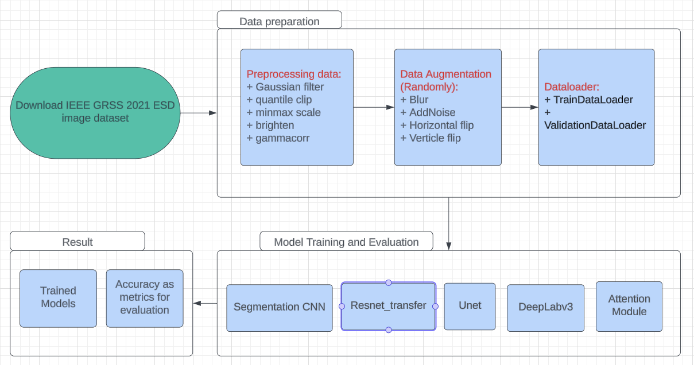

# CS175 Final Project: Semantic Segmentation on IEEE GRSS dataset

JetShark:
- Jayden Le @JaydenLe1102
- Tracy Trinh @Atracytr
- Hanvish Vdaygiri @HanMLG
- Yinxuan Liu @YinxuanLiu

## Pipeline

## Project Overviews
- Download the IEEE GRSS 2021 ESD image dataset
- Preprocess data:
	- Gaussian Filter
	- Quantile clip
	- Minmax Scale
	- Gammacorr
- Augmentation to create more data: 
	- Blur
	- AddNoise
	- Horizontal flip
	- Verticle flip
- Baseline models: 
	- UNet: https://github.com/cs175cv-w2024/final-project-jetshark/blob/main/models/UNet/last-v6.ckpt
	- Segmentation CNN: https://github.com/cs175cv-w2024/final-project-jetshark/blob/main/models/SegmentationCNN/last.ckpt
	- Resnet_transfer
- Deeplearning models: 
	- Deeplabv3 + UNet: https://drive.google.com/file/d/1oF3b6Tzk_humYaAmzOMWNKF0imN3nrE7/view?usp=sharing 
	- Attention Module + UNet: https://github.com/cs175cv-w2024/final-project-jetshark/blob/main/models/AttentionUNet/last.ckpt
	- Deeplabv3 + Attention Module + UNet: https://drive.google.com/file/d/1SBpLAjl_4C5kjBs86numIw8HGdFnBGaq/view?usp=sharing

## How to get started: 
1. Clone github repository  
2. Download  IEEE GRSS 2021 Dataset  
3. Put all the Tile directories inside data/raw/Train  
4. Run scripts/train.py with your choice of parameters and models  
5. Run scripts/evaluate.py with your model_path to evaluate and see the metrics calculate on the specify models.  

    
